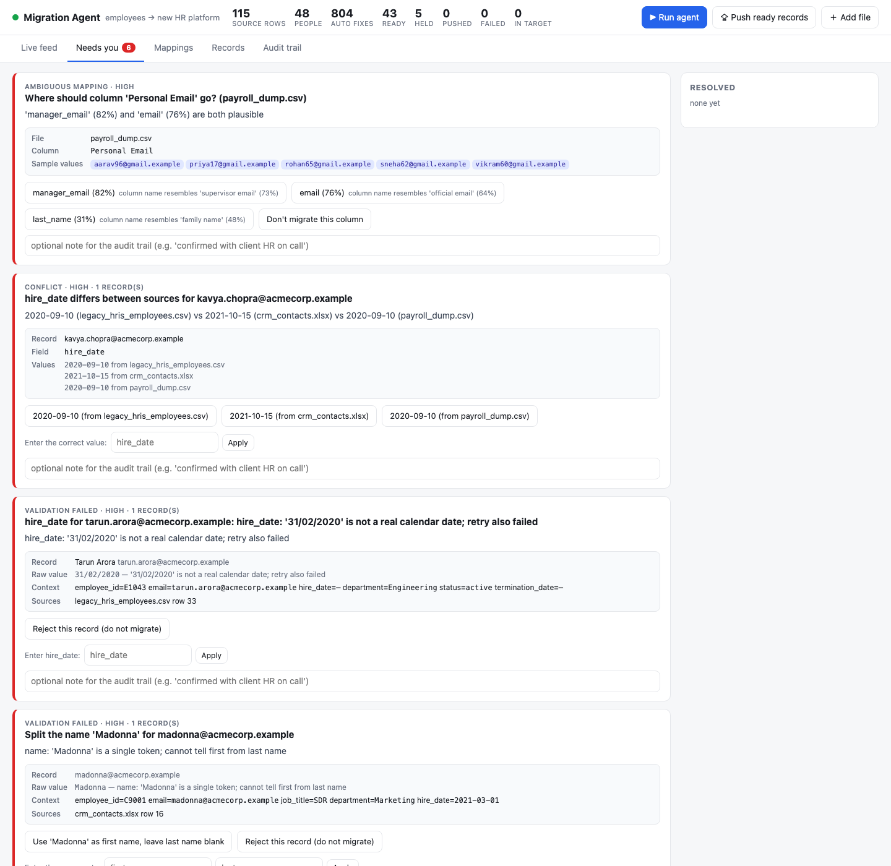

# Migration Agent — client data migration with a supervised AI agent

A small agent that takes a fictitious client's messy HR exports (CSV + Excel, different column
names, mixed date formats, duplicates, missing fields), works out how they map onto a target
schema, cleans and reconciles them into one dataset, and pushes the result to a mock target API.
It stops to ask a human **only** when it is genuinely unsure, and every decision, automatic or
human, is in the audit trail.

Built for the Darwinbox Forward Deployed Engineer take-home. See [`docs/WRITEUP.md`](docs/WRITEUP.md)
for the approach and the escalation boundary, and [`docs/DEMO.md`](docs/DEMO.md) for a scripted walkthrough.

**Demo recording:** [`docs/demo.webm`](docs/demo.webm) (1 min 40 s, plays in any browser) shows the
agent running, all seven escalations being resolved through the UI, push with retry on transient
failures, a rollback, and the audit trail. It is generated by `scripts/record_demo.py` (Playwright).



Repository: <https://github.com/maddivikash/migration-agent>

## Run it

```bash
git clone https://github.com/maddivikash/migration-agent.git && cd migration-agent
./run.sh            # creates .venv, installs deps, generates sample data if missing, starts on :8000
```

then open <http://localhost:8000> and click **Run agent**. Python 3.11+ is required; no other
services are needed. Tests: `.venv/bin/python -m pytest tests -q`.

### Optional: open-source LLM assist

The agent is deterministic-first and runs fully without a model. If an OpenAI-compatible
server is reachable it is used only for tie-breaks on genuinely ambiguous columns and unknown
enum values, and its answer is treated as a suggestion with a confidence, never as truth.

```bash
ollama pull qwen2.5:7b && ollama serve          # any OpenAI-compatible server works
MIGRATION_LLM_BASE_URL=http://localhost:11434/v1 MIGRATION_LLM_MODEL=qwen2.5:7b ./run.sh
MIGRATION_LLM=off ./run.sh                      # force heuristics only
```

## What is in the box

| Path | Purpose |
|---|---|
| `target_schema.yaml` | Target `employees` schema: types, required/unique, enum values, aliases, cross-field rules |
| `sources.yaml` | Source files in priority order (used to settle soft conflicts) |
| `sample_data/` | Three generated exports of the same ~45 people with planted problems (see `scripts/make_sample_data.py`) |
| `app/agent/` | The agent: `ingest` → `mapping` → `cleaning` → merge/dedupe → validate (`runner.py` holds the escalation policy) |
| `app/agent/llm.py` | Optional open-source LLM client (Ollama / OpenAI-compatible) |
| `app/agent/memory.py` | Mapping memory: consultant decisions persist across runs and clients |
| `app/mock_target.py` | Stub target API: idempotent upsert, delete for rollback, deterministic 503s and 422s |
| `app/main.py` | FastAPI: run control, escalation decisions, push/retry/rollback, audit endpoints |
| `app/static/` | The consultant UI (vanilla JS, no build step) |
| `tests/` | Behavioural tests for the cleaners and the escalation boundary |
| `scripts/record_demo.py` | Drives the UI with Playwright and records `docs/demo.webm` |

## Tech stack

Python 3.11, FastAPI + Uvicorn, pandas/openpyxl for ingestion, RapidFuzz for column-name
similarity, PyYAML for the schema, httpx for the target calls. Frontend is plain HTML/CSS/JS
polling the API. Optional model: any open-source LLM behind an OpenAI-compatible endpoint
(tested design target: Qwen2.5 7B via Ollama).

## How the UI is organised

- **Live feed**: every step the agent takes, in real time, with expandable details.
- **Needs you**: the escalation queue, ordered by severity. Each card carries the raw values,
  the record context, the source rows and the agent's candidate answers, so it can be resolved
  in one glance: click an option, type a correction, or reject the record. An optional note
  goes into the audit trail.
- **Mappings**: per file, every source column → target field with confidence and the reason.
  Any mapping can be overridden from a dropdown; the agent re-runs.
- **Records**: the reconciled dataset with status (ready / held / pushed / failed / rejected /
  rolled back), per-record retry and rollback, and a drawer showing every change with before,
  after, reason and actor.
- **Audit trail**: human decisions, every target API call with HTTP status and outcome, the full
  event log, and CSV/JSON export.

## Design notes

- **A run is a pure function of (files, schema, human decisions).** Resolving an escalation adds a
  decision and re-runs the pipeline in milliseconds. There is no mutable partial state to get
  out of sync, and any state in the audit trail is reproducible.
- **Push order respects manager → report dependencies**, records whose manager is still held are
  deferred rather than failed, rollback runs in reverse order, and the upsert is idempotent so
  retries are safe.
- **Mapping memory** (`.state/mapping_memory.json`) is the "delta on top of the AI": a consultant's
  answer to "where does column X go" or "what does department code BD mean" is remembered, so the
  agent asks less on the next run and starts warm on the next client using the same legacy tool.
